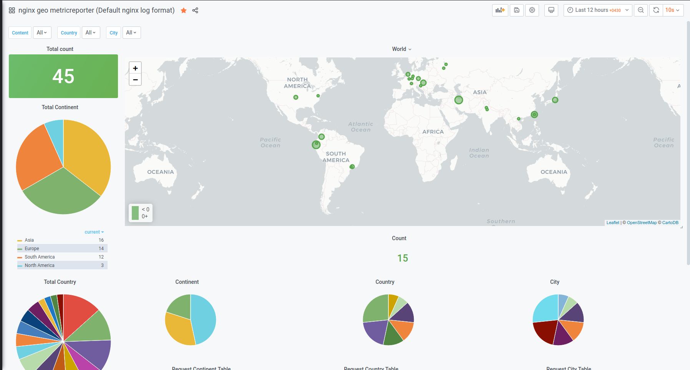
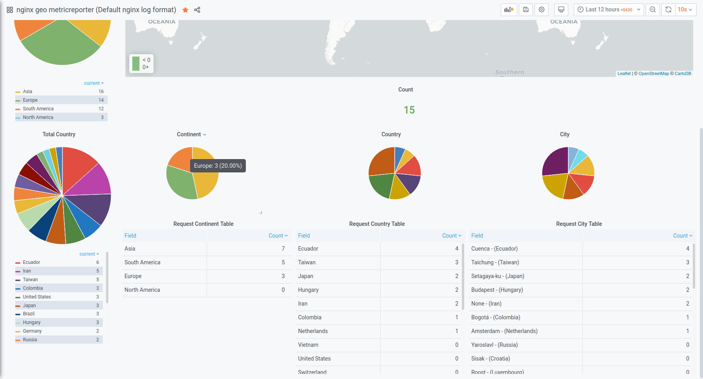
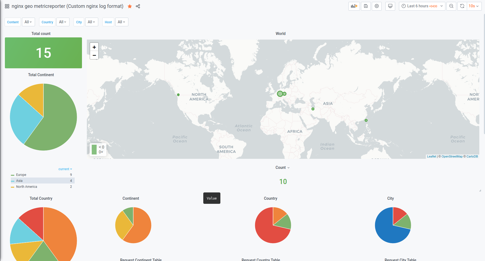
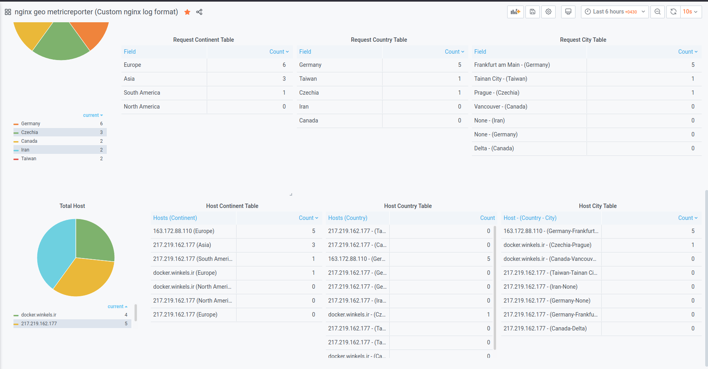
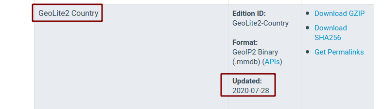

# Nginx Geo MetricsReporter
Simple metrcis reporter with Python for track visitors' location and where connected to [Nginx]("https://www.nginx.com/") webservice.

## How it works
Nginx-parser, parsing Nginx `access.log` line by line, after recognizing any change in log file, a post request will be sent with some data like `$remote_addr` and `$host` to the Metricsreporter Webservice. Metricsreporter will grab information from `Geo dataset` with previous step data and make that a metrics for `Proemtheus` on `/metrics`.

> **Note:** This application uses Nginx log file (Main Nginx that installed on server), not a [Ingress-nginx]("https://github.com/kubernetes/ingress-nginx") logs(On [Kubernetes]("https://kubernetes.io/")).

## Nginx logFormat
Nginx-parser uses a default nginx log format, that gives you information about location of your visitors. But if you want more information for example what kind of host or how many hosts were requested by the visitors, you should change nginx log format. For example, for our custom dashboard, You should change this part of `nginx.conf`:

```
log_format main '$remote_addr - $remote_user [$time_local] '
                    '"$request" $status $body_bytes_sent '
                    '"$http_referer" "$http_user_agent" "$host"';

access_log /var/log/nginx/access.log main;
```

> **Note:** By default, `log_format` section doesn't exist in `nginx.conf`, You should add the code above.

And change `LOGREGFORMAT` from `nginx-geo-metricsreporter/values.yaml`(uncomment that in `nginx-geo-metricsreporter/values.yaml`):

`
(?P<ipaddress>\d{1,3}\.\d{1,3}\.\d{1,3}\.\d{1,3}) - - \[(?P<dateandtime>\d{2}\/[a-z]{3}\/\d{4}:\d{2}:\d{2}:\d{2} (\+|\-)\d{4})\] ((\"(GET|POST) )(?P<url>.+)(http\/1\.1")) (?P<statuscode>\d{3}) (?P<bytessent>\d+) (["](?P<refferer>(\-)|(.+))["]) (["](?P<useragent>.+)["]) (["](?P<host>.+)["])
`

If you have a different log format, for your own usage, you can simply change `LOGREGFORMAT` in `values.yaml`. This variable tells the application what Regex format should be used for parsing lines of log. For example Nginx uses this log format by default:

`127.0.0.1 - - [03/Jul/2020:19:31:17 +0430] "GET / HTTP/1.1" 304 0 "-" "Mozilla/5.0 (X11; Ubuntu; Linux x86_64; rv:77.0) Gecko/20100101 Firefox/77.0"
`

And regex work with that should be like this:

`(?P<ipaddress>\d{1,3}\.\d{1,3}\.\d{1,3}\.\d{1,3}) - - \[(?P<dateandtime>\d{2}\/[a-z]{3}\/\d{4}:\d{2}:\d{2}:\d{2} (\+|\-)\d{4})\] ((\"(GET|POST) )(?P<url>.+)(http\/1\.1")) (?P<statuscode>\d{3}) (?P<bytessent>\d+) (["](?P<refferer>(\-)|(.+))["]) (["](?P<useragent>.+)["])
`

Application uses that Regex for parsing line, and the result is:

```json
{
  "ipaddress": "127.0.0.1",
  "dateandtime": "04/Jul/2020:20:45:01 +0430",
  "url": "/",
  "statuscode": "200",
  "bytessent": "134",
  "refferer": "-",
  "useragent": "Mozilla/5.0 (X11; Ubuntu; Linux x86_64; rv:78.0) Gecko/20100101 Firefox/78.0"
}
```

> **Note:** Do NOT change or rename the keys name, if you do, application cannot recognize that.

## Monitoring and Visualization

You can simply use that metrics to see your visitors' location on world map. I created a Grafana dashboard with [Woldmap](https://grafana.com/grafana/plugins/grafana-worldmap-panel),[piechart](https://grafana.com/grafana/plugins/grafana-piechart-panel) panel and some tables ordered by `Continent`,`Country` and `City`.

### [Default dashboard](https://grafana.com/grafana/dashboards/12733)
You can learn more about how dashboard can be installed from [this](https://grafana.com/grafana/dashboards/12733) page.

  

> **Note:** This dashboard works with default configuration setup (default nginx log format)

### [Custom dashboard](https://grafana.com/grafana/dashboards/12734)
You can learn more about how dashboard can be installed from [this](https://grafana.com/grafana/dashboards/12734) page.

  

> **Note:** This dashboard works with custom configuration setup (our custom nginx log format)

## Install with [Helm](https://helm.sh/)

Clone repository:

```bash
$ git clone LINK
$ cd LINK
```

You can simply install it with Helm:

```bash
$ helm install nginx-geo-metricsreporter nginx-geo-metricsreporter
```

The command deploys Nginx-geo-metricsreporter on a Kubernetes cluster in the default configuration.

## Configuration
| Parameter                            | Description                                         | Default                     |
| ------------------------------------ | --------------------------------------------------- | --------------------------- |
| `nodeSelector`                       | node labels for pod assignment                      | `{}`                        |
| `tolerations`                        | node taints to tolerate (requires Kubernetes >=1.6) | `[]`                        |
| `affinity`                           | pod affinity                                        | `{}`                        |
| `nginxparser.Name`                   | nginxparser container name                          | `nginxparser`               |
| `nginxparser.image.repository`       | nginxparser container image repository              | `true`                      |
| `nginxparser.image.tag`              | nginxparser container image tag                     | `latest`                    |
| `nginxparser.image.pullPolicy`       | nginxparser container image pull policy             | `IfNotPresent`              |
| `nginxparser.INPUT_LOG`              | input log file                                      | `/var/log/nginx/access.log` |
| `nginxparser.INTERVAL`               | scrap timeout for parsing logs                      | `5`                         |
| `nginxparser.LOGREGFORMAT`           | nginx log format                                    | `(?P<ipaddress ...`         |
| `nginxparser.resources`              | nginxparser pod resource requests & limits          | `{}`                        |
| `metricsreporter.Name`               | metricsreporter container name                      | `metricsreporter`           |
| `metricsreporter.image.repository`   | metricsreporter container image repository          | `true`                      |
| `metricsreporter.image.tag`          | metricsreporter container image tag                 | `latest`                    |
| `metricsreporter.image.pullpolicy`   | metricsreporter container image pull policy         | `IfNotPresent`              |
| `metricsreporter.service.type`       | service type                                        | `ClusterIP`                 |
| `metricsreporter.service.port`       | TCP port on which the service is exposed            | `8080`                      |
| `metricsreporter.resources`          | nginxparser pod resource requests & limits          | `{}`                        |

> **Note:** We recommend using `nginxparser.INTERVAL` (Don't change value to 0).

> **Note:** Make sure you select correct `nodeSelector` that installed nginx webservice on it.

> **Note:** This application isn't scalable yet. So don't scale number of pod from 1 to more.

> **Note:** Nginx `access.log` is under the `/var/log/nginx` directory by default, if you store log on different location you should change `nginxparser.INPUT_LOG` for that.

## Dataset
We are geting our information form static `GeoLite2-City.mmdb` database file that can be old after while. If you always want to be updated, signup to [maxmind.com](https://www.maxmind.com/en/geoip2-services-and-databases) and download your free `GeoLite2-City.mmdb` database and replace with `geo-metricsreporter/datasets/GeoLite2-City.mmdb`, build Docker image for yourself and change `metricsreporter.repository` and `tag` from `nginx-geo-metricsreporter/values.yaml` to update the app config.



## Contributing , idea ,issue
Feel free to fill an issue or create a pull request, I'll check it ASAP